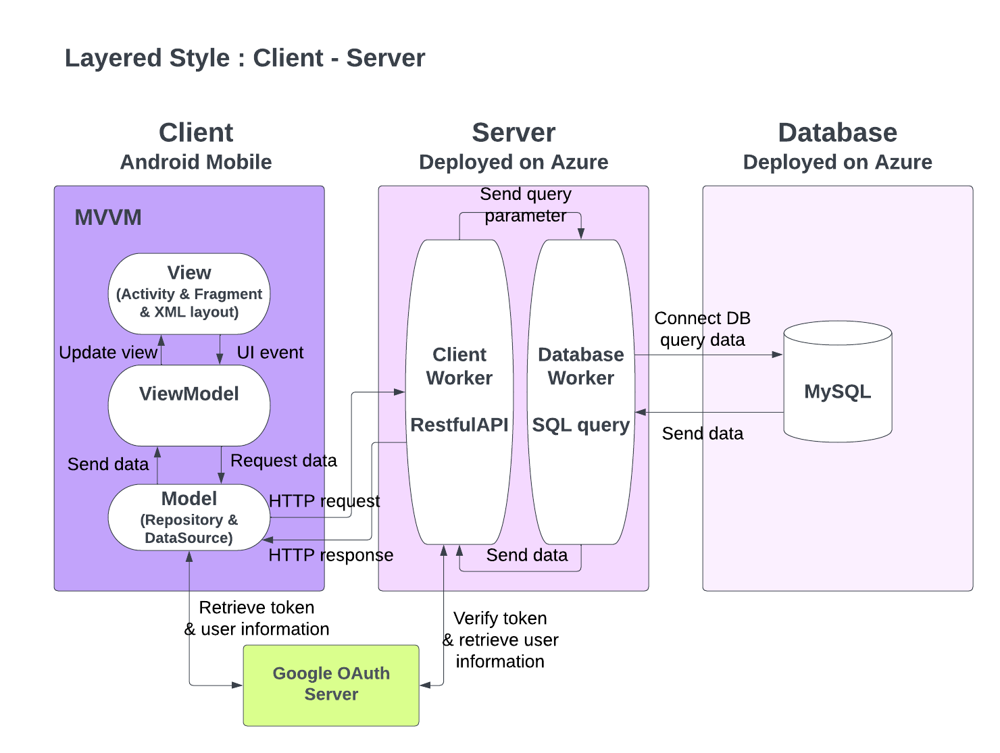
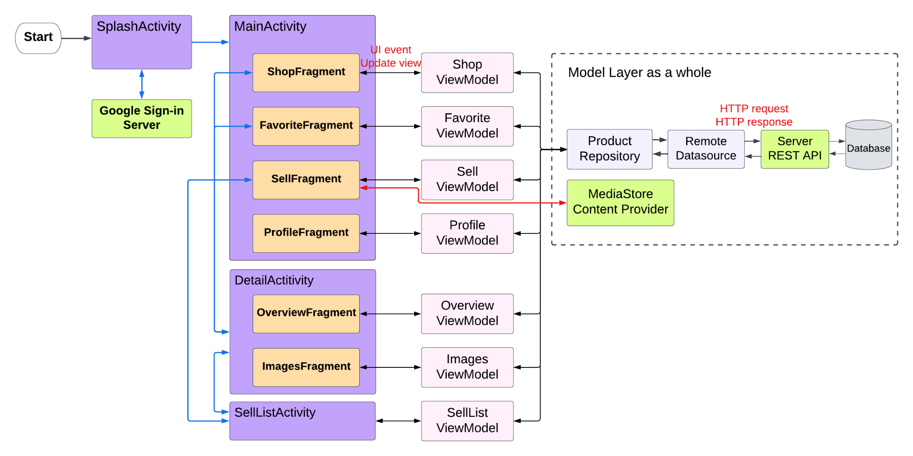
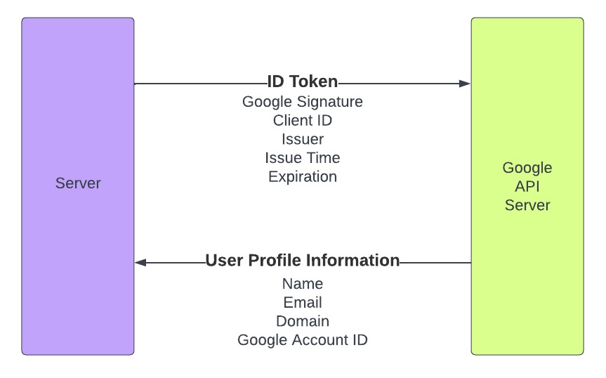
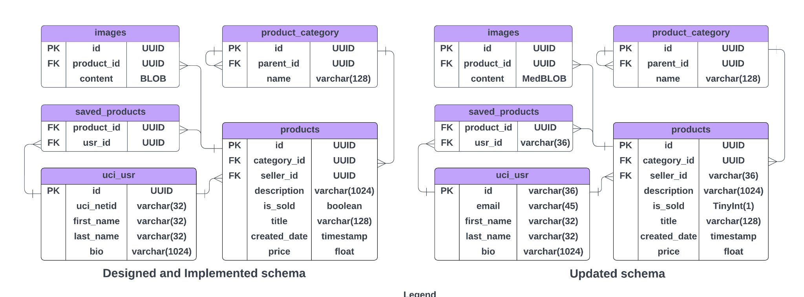
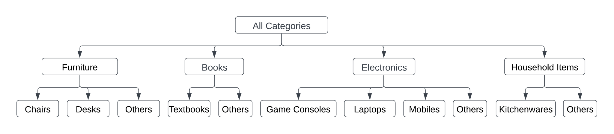
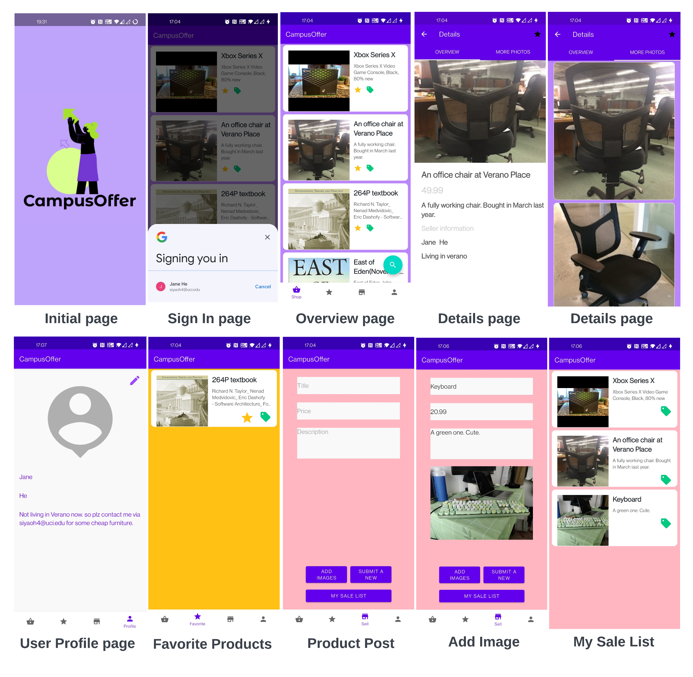

# CampusOffer

**Team:** Danny Do, Siyao (Jane) He, Shengwen (Stella) Ma,
Fengnan (Sonia) Sun

# 1. Product Features

Many students need to get rid of their old items when they move off
campus, whether it be to a new apartment or graduating to the next stage
of their lives. Meanwhile, there are many other students that need to
buy items as they move in. These can include transfer students,
freshman, international students, etc.. It can be difficult to find
affordable goods as students.

Our goal creating this application is to connect this community
together. This will be an application that allows students to sell and
buy second-hand items strictly for student use. We will implement this
through the Google Sign In API. Through this application we hope to
augment student safety, reliability, and convenience.

There are many features offered with Campus Offer. Users can view and
browse all items that have been posted for sale. Users may post their
items including descriptions, images, and pricing. Users can also update
their profile to include their contact information.

# 2. Architectural Design

**Fig.1 Architectural design of CampusOffer app**

As the figure.1 shows, our software is designed using the MVVM
architecture and client-server layer style. This approach was chosen
because it offers several advantages over other architectures. By
separating the presentation layer (view) from the business logic layer
(model), the MVVM architecture allows for greater modularity and easier
maintenance of the codebase. This separation of concerns also enables
multiple developers to work on different parts of the application in
parallel, leading to more efficient development processes and faster
time-to-market. Additionally, the use of data binding between the view
and view model layers enables more responsive and dynamic user
interfaces.

In addition to the MVVM architecture, we have implemented a
client-server layer style, which further enhances the scalability and
maintainability of our software. This architecture separates the client
and server components of the application, with the client responsible
for rendering the user interface and the server responsible for
processing requests and managing data. This approach allows for greater
flexibility in the deployment and scaling of the application, as the
client and server components can be hosted on different servers and
scaled independently as needed. Additionally, this separation of
concerns enables greater security and reliability, as the client does
not have direct access to the underlying data and business logic of the
application.

# 3. Implementation

## 3.1 Client

As shown in Fig 2, we are using the MVVM architecture in our software.

We implemented four Activities, the Splash Screen, the Main Activity
(including the four tabs Shop Fragment, Favorite Fragment, Sell
Fragment, and Profile Fragment), the Detail Activity (Overview Fragment,
Images Fragment), and the Sell List Activity. They communicate with each
other by explicit message based invocation. These fragments and
activities are responsible for rendering the user interface and
interacting with the user. They are connected to the ViewModel layer
through data binding, which allows for more responsive and dynamic user
interfaces.

In addition to the presentation layer, we have also implemented 7
ViewModel components, each corresponding to a specific use case within
the application. These ViewModel components are responsible for handling
the business logic and data processing of the application. They
communicate with the Model layer, which contains the data sources and
repositories, to retrieve and manipulate data as needed. By separating
the business logic and data processing from the presentation layer, we
achieve greater modularity and maintainability of our codebase, as well
as improved testability and reusability of our components.

In the Model layer of our software, Media Store Content Provider will be
triggered when a user want to upload images in the Sell Fragment. The
product data is managed by the Product Repository and Remote Data Source
will communicate to our Server. We use Retrofit and Gson to manage the
communication with the REST API and handle serialization and
deserialization of data.

**Fig.2 Interaction between different components**

## 3.2 Server 

Once a user is authenticated, the client will be able to send requests
to the server which will then read and write data to the database about
users and the posted products.

### 3.2.1 Authentication

We implemented user authentication on the server with Google Sign-In, a
feature of Google\'s identity platform that allows users to authenticate
with a Google account and sign in to third-party applications and
services using their Google credentials(here means UCI google email).
Google Sign-In uses OAuth 2.0, an industry-standard protocol for
authorization, to authenticate users and obtain access tokens that can
be used to access Google APIs.

**Fig.3 Authentication workflow**

The OAuth 2.0 authorization flow used by Google Sign-In involves the
following steps:

The authentication workflow shows that our server is given an ID Token
made up of a few components. The server sends it, then the Google API
server verifies the integrity of the ID Token. Once the ID Token is
verified, Google Server responds to our server with the Google user
profile information.

ID token parts includes:

-   Google signature which is regularly rotated.

-   AUD matches client ID to ensure it is our application and not malicious application requesting access to user data

-   ISS (who issued token) matches accounts.google.com

-   IAT issue time

-   Expiration has not passed

A JSON payload of information will be returned:

-   Name

-   Email

-   Google account numerical identifier

Google Sign-In provides several benefits over traditional
username/password authentication, including: Improved security,
convenience, and access to Google APIs.

### 3.2.2 API 

Our API is a flexible, stateless, and RESTful web service. The API is
designed to handle the increase in users and server pressures in the
future.

#### List of Endpoints

-   GET GetCategoryByID

-   GET GetSubCategory: Receives a category ID, return the category IDs for all the categories under it

-   GET GetProductByID

-   GET GetUserByID

-   GET GetImageByID, return the image in Base64 encoding, as suggested by the Proffesor

-   GET GetProductByUser: Receives a user ID, return the product IDs of all the products posted by this user

-   GET GetSavedProducts: Receives a user ID, return the product IDs of all the products saved by this user

-   GET ProductsUnderCategory

-   POST PostProduct

-   POST Login

-   PUT UploadImage, in the format of Base64 encoding, as suggested by the Proffesor

-   PATCH MarkSold

-   PATCH UpdateProfile

-   PATCH MarkSaved

#### Advantages

**Security**: Our SQL queries are all prepared statements, which makes
our server invulnerable to SQL injection. We also implemented Google
OAuth 2.0 sign-in.

**Decoupling**: The two components of ClientWorker and Database Worker
are decoupled with each other. This helps with testability and
flexibility.

**Error Handling**: In case of errors, our API returns appropriate HTTP
status codes, for example, 204 No Content for missing data in payload.
404 Not Found when querying using a non-existent ID in the database.

**To conclude**, our API provides a flexible, stateless, scalable, and
secure web services.

3.3 Database

The database has been designed and developed following the Boyce-Codd
Normal Form (BCNF), which reduces data redundancy and minimizes the risk
of manual errors. The type is Azure database for MySQL flexible server.
Our server version is 5.7. Our backend server received a unique google
ID from Google API server in process of authentication, so we updated
the database to accommodate it accordingly, instead of the previously
UUID randomly generated either in the server or in the database. The
tables' relationship and update comparison details have been
demonstrated in the diagram below:

**Fig.4 Updated Database Schema**

**Uci_usr table** is the root table of our main update in the database.
We have changed the id type to variable character, and replaced
uci_netId with an email address, since the primary key has been changed
to google ID. However, email is not necessarily the only contact info
one could have. We gave enough space to the bio field, so it may include
any information the user wants.

**Products table** is the central table of the database and stores all
the necessary information about the products sold in our app. The
Seller_id field type has been updated as usr_id changed. Additionally,
the Is_sold field has been updated with tinyint from boolean to fit the
format on our server.

**Saved_products table** only includes foreign keys Usr_ID and
Product_ID. Usr_ID field type has also been changed to variable
character. This table serves the feature "favorite" in our app.

**Images table** content field type has been changed to medium blob to
accommodate larger base64 image size up to 16MB instead of 64KB.

**Product_category table** is a hierarchical table that helps in
categorizing products and makes it easy for users to filter out products
they want.

**Figure 5. Products Category**

# 4. Screenshots of Product

**Figure 6. CampusOffer Snapshots**

# 5. Reflection

During the project, we encountered certain obstacles that prevented us
from achieving certain functionalities. However, we learned that proper
delegation, and having a good system design and architectural design was
very effective. From the beginning, we had a project roadmap and
allotted weekly team work hours. This allowed us to reach unforeseen
obstacles sooner rather than later. Furthermore, the modular design we
had been building allowed us to be flexible and work in parallel, and we
were able to overcome them quickly and efficiently.

# Appendix

## Github Repository

Github Repository for Frontend:
[[https://github.com/SoniaSun810/CampusOffer_Client.git]](https://github.com/SoniaSun810/CampusOffer_Client.git)

Github Repository for Backend:
[[https://github.com/SiyaoIsHiding/CampusOfferBackend]](https://github.com/SiyaoIsHiding/CampusOfferBackend)

## Published API documentation

[[https://documenter.getpostman.com/view/24275656/2s935rLNrX]](https://documenter.getpostman.com/view/24275656/2s935rLNrX)
